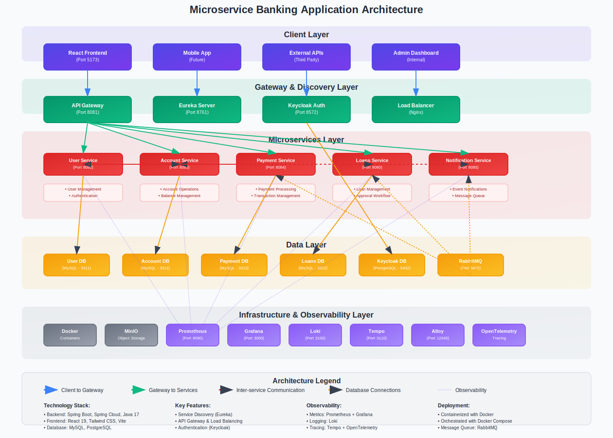

# Microservice Banking Application



## Overview

This project is a modern, scalable, and observable microservice-based banking application. It features a React frontend, multiple Spring Boot microservices, API Gateway, service discovery, authentication, and a full observability stack.

---

## Features
- **User Registration & Authentication** (Keycloak)
- **Account Management** (Create, List, Transfer)
- **Payments** (Send, Receive, History)
- **Loans** (Apply, Approve, List, Eligibility)
- **Notifications** (Email, In-app)
- **Admin Dashboard**
- **API Gateway & Service Discovery**
- **Observability** (Grafana, Prometheus, Loki, Tempo)
- **Dockerized Microservices**

---

## Architecture


- **Frontend:** React (Vite) SPA
- **API Gateway:** Central entry point, routing, security
- **Service Registry:** Eureka for service discovery
- **Keycloak:** OAuth2 authentication & authorization
- **Microservices:**
  - User Service
  - Account Service
  - Payment Service
  - Loans Service
  - Notification Service
- **Databases:** Each service has its own DB
- **Observability:** Grafana, Prometheus, Loki, Tempo

---

## Technologies
- **Frontend:** React, Vite, Axios, Context API
- **Backend:** Spring Boot, Spring Cloud, Spring Data, R2DBC/JPA, Lombok
- **API Gateway:** Spring Cloud Gateway
- **Service Discovery:** Eureka
- **Auth:** Keycloak
- **Observability:** Grafana, Prometheus, Loki, Tempo
- **Containerization:** Docker, Docker Compose

---

## Getting Started

### Prerequisites
- Docker & Docker Compose
- Node.js (for frontend dev)

### Quick Start
```bash
# 1. Clone the repository
$ git clone <repo-url>
$ cd Microservice-Banking-Application

# 2. Start all services
$ docker-compose up --build

# 3. Frontend (if running separately)
$ cd BankApplicationUi
$ npm install
$ npm run dev
```

### Service Ports
| Service              | Port   |
|----------------------|--------|
| React Frontend       | 5173   |
| API Gateway          | 8081   |
| User Service         | 8082   |
| Account Service      | 8083   |
| Payment Service      | 8084   |
| Notification Service | 8085   |
| Loans Service        | 8080   |
| Eureka Server        | 8761   |
| Keycloak             | 8572   |
| Grafana              | 3000   |
| Prometheus           | 9090   |
| Loki                 | 3100   |
| Tempo                | 3200   |

---

## Example API Requests

### Register User
```http
POST /api/users/register
Content-Type: application/json
{
  "identity": "12345678901",
  "password": "password",
  "emailId": "user@example.com",
  "firstName": "John",
  "lastName": "Doe",
  "contactNumber": "555-1234"
}
```

### Create Account
```http
POST /api/accounts/create
Content-Type: application/json
{
  "accountType": "CHECKING",
  "currency": "TRY",
  "balance": 1000.0,
  "userId": "<user-id>"
}
```

### Make Payment
```http
POST /api/payments
Content-Type: application/json
{
  "senderAccountId": "...",
  "receiverAccountId": "...",
  "amount": 250.0,
  "currency": "TRY",
  "paymentType": "IMMEDIATE",
  "senderEmail": "user@example.com",
  "receiverEmail": "other@example.com"
}
```

---

## Screenshots

### Login Page


### Example Card (Vite Logo)


---

## Observability
- **Grafana:** [http://localhost:3000](http://localhost:3000)
- **Prometheus:** [http://localhost:9090](http://localhost:9090)
- **Loki:** [http://localhost:3100](http://localhost:3100)
- **Tempo:** [http://localhost:3200](http://localhost:3200)

---

## Contributing
Pull requests are welcome! For major changes, please open an issue first to discuss what you would like to change.

---

## License
[MIT](LICENSE)
